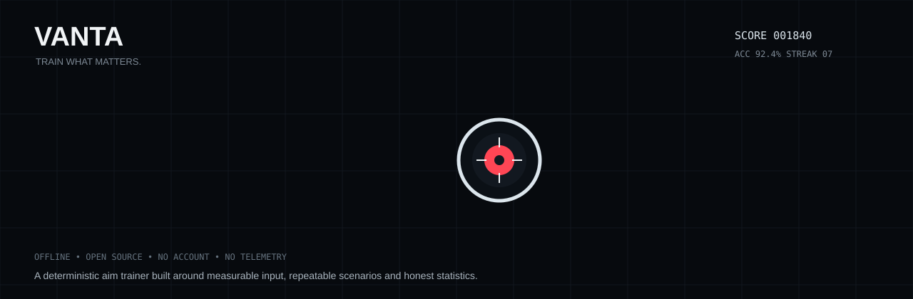

# VANTA



[](https://github.com/aimtrainer-code/aim-trainer/actions/workflows/tests.yml) [](LICENSE)

**TRAIN WHAT MATTERS.**

A free, open-source, offline-first aim trainer for competitive FPS players. **Pick a drill, aim, shoot, measure, repeat.** Godot 4,
typed GDScript, primary platform Windows 11 x64. No account, no telemetry, no network
requirement.

> **Project status: playable 0.2.0.** VANTA now boots into a complete user loop: choose from the
> shipped training drills, play a timed aim session, see score/accuracy/reaction results,
> and replay or switch drills. The existing deterministic simulation/content architecture
> remains underneath this lightweight public renderer and is ready for the next 3D world pass.

## What is built and verified

The project has a headless self-test suite (`tools/test.sh`) that performs a full script
compile/parse sweep before running the test cases. CI executes the same command on every
push and pull request. The exact assertion and script counts are reported by the current
CI run rather than hard-coded here.

- **Sensitivity and input math** — a mouse count converts to degrees by one stated
  coefficient; cm/360 and the inverse; calibration profiles; monitor-distance matched
  zoom. No smoothing, no acceleration, no curves, no hidden rounding.
- **Settings** — user-editable JSON is treated as hostile input: every value is
  checked, clamped, and *repaired with a report* rather than crashing the game.
- **Save layer** — versioned stores, atomic-ish writes (temp file, read back, then
  replace), automatic recovery from the previous generation, quarantine of damaged
  files (moved aside, never deleted), migration from the prototype format, and
  export/import with checksums. See [`docs/SAVE_FORMAT.md`](docs/SAVE_FORMAT.md).
- **Scenario format** — a versioned, validated schema with 12 modes, 5 transfer
  stages, and specs for spawn, lifetime, motion, reaction, ammunition, rules, scoring,
  success criteria and adaptive difficulty. A scenario that references a missing arena
  or weapon is refused at load, not at runtime.
- **Content as data** — 10 scenarios, 5 weapons and 3 arenas ship in
  [`content/`](content/), all validated on load.
- **Simulation** — a fixed 480 Hz step with interpolation for rendering, deterministic
  from a seed, analytic hit registration against the same primitives that are drawn
  (never a separate collider), cover resolved before targets, and one trigger pull
  counted as one shot in every statistic.
- **Scoring and statistics** — integer arithmetic, per-scenario terms, no opaque
  composite score, and pass/fail criteria declared by the scenario itself. See
  [`docs/SCORING.md`](docs/SCORING.md).

## What comes next

- Full 3D arena rendering and direct visualisation of the existing analytic simulation.
- Richer weapon behavior, movement and target geometry in the public renderer.
- Curriculum, Rival, community content browser and benchmark tooling.
- Additional project documentation covering building, testing, contribution rules,
  security, release notes and the current project report.
- **License:** MIT. See [`LICENSE`](LICENSE).

## Documentation

| Document | Purpose |
| --- | --- |
| [`docs/BUILDING.md`](docs/BUILDING.md) | Local setup and Windows build flow |
| [`docs/TESTING.md`](docs/TESTING.md) | Test strategy and CI contract |
| [`docs/PROJECT_REPORT.md`](docs/PROJECT_REPORT.md) | Architecture and engineering overview |
| [`docs/RELEASING.md`](docs/RELEASING.md) | Version tags and Windows release pipeline |
| [`CHANGELOG.md`](CHANGELOG.md) | Version history |
| [`RELEASE_REPORT.md`](RELEASE_REPORT.md) | 0.2.0 release scope and limitations |
| [`CONTRIBUTING.md`](CONTRIBUTING.md) | Contribution workflow and coding rules |
| [`SECURITY.md`](SECURITY.md) | Security and local-data reporting |

## Download / run

For Windows, the project has a GitHub Actions release pipeline that builds an x64 `.zip` on version tags.
If a release is available, download the Windows artifact from the repository's **Releases** page.
For developers, open the project in Godot 4.7.2 and run the main scene.

### Running the tests

The repository also has a headless self-test suite:

```bash
GODOT=/path/to/Godot_v4.7.2-stable_linux.x86_64 ./tools/test.sh
```

The engine version is pinned in [`.github/godot-version.txt`](.github/godot-version.txt),
and CI runs exactly this command on every push and pull request
([`.github/workflows/tests.yml`](.github/workflows/tests.yml)). No test framework is
downloaded: the runner is [`tests/run_tests.gd`](tests/run_tests.gd) and the whole
suite needs nothing but a Godot binary and this repository.

Launching the project (`godot --path .`) opens the drill selector. Choose a scenario with the mouse or `1`–`0`,
press Enter to start, use left click to shoot, `R` to restart, `Esc` to pause, and `M` on the results screen to return.
Runs are stored through the existing local save service. The game is offline and uses no proprietary game assets.

## Design rules

These are the rules the code is written against. They are the reason several obvious
shortcuts are deliberately not taken.

- **Offline first.** No account, no telemetry, no server. A save file is local JSON that
  the player can read, export and edit.
- **Input is sacred.** One coefficient, one multiplication, nothing else. Frame-time
  compensation, smoothing and acceleration are not implemented, and neither are fake
  latency numbers.
- **Determinism.** A scenario with a fixed seed produces the same run on any machine,
  which is what makes a benchmark repeatable and a regression test possible.
- **What you see is what is hit.** Hit regions are the same primitives the renderer
  draws, resolved analytically on the same interpolated state that was displayed.
- **No invented authority.** VANTA does not claim to be scientifically validated, to be
  used by professionals, or to guarantee improvement. Numbers that cannot be measured
  are not shown.
- **No proprietary game content.** No game assets, maps, models, sounds or UI copies,
  and no interaction with another title's memory, files or anti-cheat.

## Repository layout

| Path | Contents |
| --- | --- |
| `src/core/` | Application bootstrap, logging, settings, display, math, RNG, style |
| `src/input/` | Mouse input service, sensitivity model, bindings, diagnostics |
| `src/player/` | Player state, crosshair model and geometry |
| `src/simulation/` | Clock, hit registration, spawn director, attempt runtime, statistics, arenas, target motion |
| `src/weapons/`, `src/targets/` | Weapon definitions/runtime and target hit regions |
| `src/scenarios/` | Scenario schema and its specs |
| `src/save/` | Profile, progress and history stores with recovery |
| `content/` | Shipped scenarios, weapons and arenas as JSON |
| `tests/`, `tools/` | Self-test suite and the entry-point script |
| `docs/` | Save format and scoring documentation (more to come) |

## Third-party assets

The two bundled fonts are Inter and JetBrains Mono, both under the SIL Open Font
License 1.1, with their licence texts committed next to the files in
[`assets/fonts/`](assets/fonts/). VANTA ships no third-party code, models, textures or
sounds.
